<div align="center">

# Cerberus

### Autonomous Patch Verification Gate

**Agents write patches. Cerberus decides whether a patch has earned a pull request.**

[](LICENSE)

[Demo](#demo) · [How It Works](#how-it-works) · [Results](#key-results) · [Security](#security-model) ·
[Live GitHub](#live-github-integration) · [Quick Start](#quick-start)

</div>

---

## What is Cerberus?

Cerberus is an independent verification gate for bug-fix patches. A patch may come from a human, a script, an AI
coding agent or any other automated process; Cerberus holds every one to the same standard and does not accept the
author's own test as sufficient evidence.

For each patch it independently verifies that:

- the bug actually reproduces on the unpatched code, for the reason the report describes;
- the patch fixes it;
- nothing that worked before now fails;
- the change stays within the allowed scope and does not rewrite the tests that judge it.

Every run ends in exactly one decision, with the reason and the evidence recorded: **`ADMITTED`**, **`REFUSED`** (with a
code naming the gate that stopped it) or **`ERROR`**.

## Why Cerberus?

A patch can make its own reproduction test pass and still be wrong.

Whoever writes a patch also chooses how to judge it. An AI coding agent picks the change, can add or edit the test,
runs only the test it cares about, and reports success — while an existing behaviour elsewhere quietly breaks. The same
is true of a hurried human. Neither case is malicious; the evidence is simply incomplete, and the reviewer inherits the
risk.

Cerberus is the independent layer between "the patch author says it works" and "a reviewer spends time on it". It
re-derives the evidence itself: it reproduces the bug, applies the patch in an isolated sandbox, re-runs the project's
own test suite against a recorded baseline, and measures what the patch actually changed.

## Key Results

| Evidence | Result |
| --- | --- |
| Real open-source repositories (sqlparse, boltons, more-itertools) | **11 / 11** expected verdicts |
| Correct fixes approved in the frozen benchmark | **7 / 7** — none wrongly rejected |
| Wrong patches approved, versus approving any patch whose own test passes | **65% → 36%** (13 of 20 → 4 of 11) |
| Automated test suite | **231** tests, including 13 run inside real Docker containers |
| Live GitHub pull requests across two repositories | **7 / 7** expected ✅ / ❌ Check Runs |

<p align="center">
  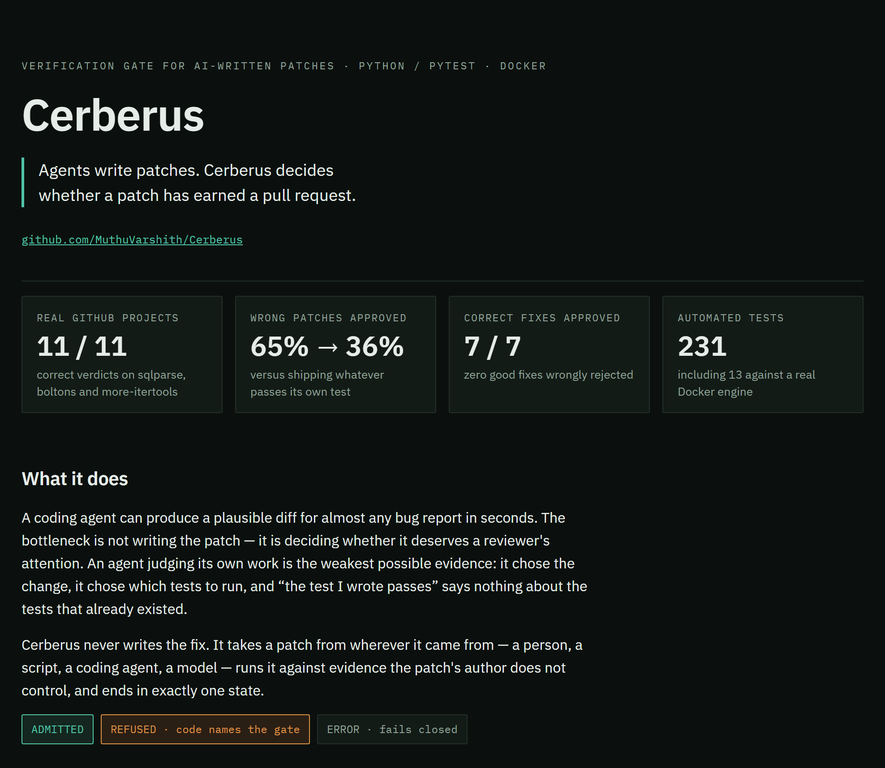
</p>

The benchmark deliberately includes *plausible-but-wrong* patches: fixes that pass every visible test, including the
reproduction test, but fail hidden specification tests the gate never sees. Four of those were admitted, and they are
reported rather than hidden. Passing visible tests is strong evidence, not proof of semantic correctness.

## Demo

<p align="center">
  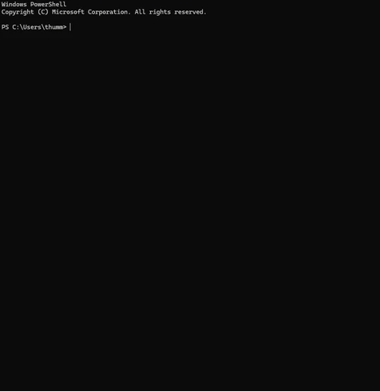
</p>

A real terminal session, sped up to 30 seconds. `python main.py --demo` takes a small project with a divide-by-zero
bug through every stage: the bug is reproduced (RED ×3), the existing tests are recorded as a baseline, the patch is
applied, the fix is confirmed (GREEN ×3), the regression and scope checks pass, and the patch is **ADMITTED**. The
session then checks four patches against the real sqlparse repository — the maintainers' fix is admitted, a fix that
breaks three existing tests is refused with **`REGRESSION`**, and the same fix with those tests edited to hide the damage
is refused with **`SCOPE_VIOLATION`**.

The full recording of a live GitHub session (4 min 18 s) is in
[`docs/video/`](docs/video/cerberus-github-app-full-demo.mp4).

## How It Works

```text
  bug report + reproduction test              patch (human · script · AI coding agent · model)
                 │                                         │
                 ▼                                         ▼
 ┌─────────────────────────────────────────────────────────────────────────┐
 │  TRIAGE → SETUP → RED ×3 → BASELINE → LOCALIZATION → PATCH → GREEN ×3   │
 │        → REGRESSION → SCOPE → ADMISSION                                 │
 │                                                                         │
 │  SETUP is the only networked phase (dependency installation).           │
 │  Everything after it runs offline inside a Docker container.            │
 └─────────────────────────────────────────────────────────────────────────┘
                 │
                 ▼
    ADMITTED · REFUSED (code) · ERROR       evidence: artifacts/<run_id>/run.json
```

Every run writes an auditable evidence file: the base commit, the reproduction test and its output, per-attempt patch
history, the sandbox used, and the gate-by-gate decision. Test outcomes come only from JUnit XML — a result that cannot
be read is a refusal, never a pass.

<p align="center">
  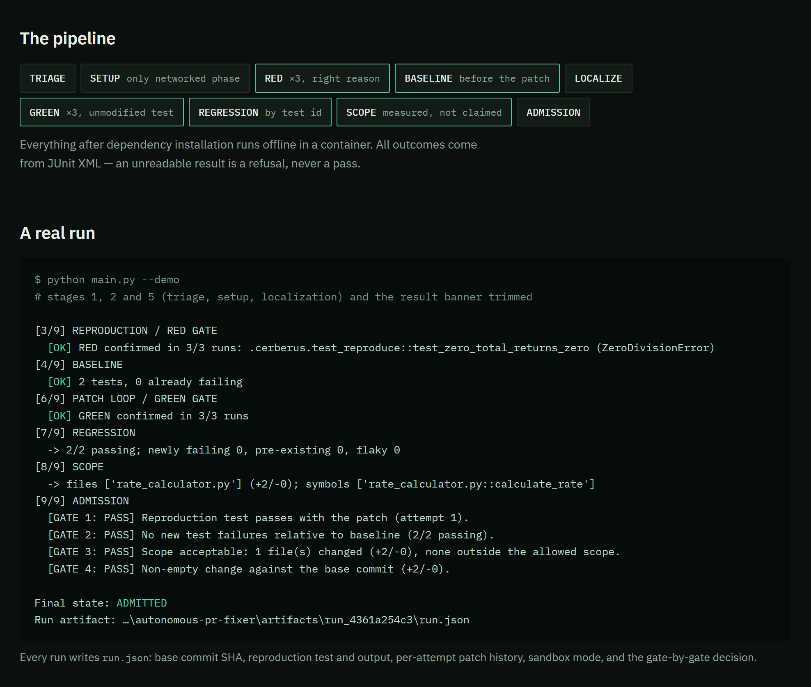
</p>

## Verification Gates

| Gate | What it verifies |
| --- | --- |
| **RED** | The bug reproduces on the unpatched code for the correct reason — an assertion, an exception named in the report, or an exception raised in repository code — identically in 3 runs. Import, syntax and collection errors never count. |
| **BASELINE** | The repository's own test suite is run on the unpatched commit and every result is recorded by test ID. |
| **GREEN** | The original reproduction test passes with the patch in 3 of 3 runs, and its content is unchanged (SHA-256 checked). |
| **REGRESSION** | No test that passed at baseline newly fails, errors or stops running. Failures that already existed are reported, not blamed on the patch; suspected regressions are re-checked on the base code to separate flaky tests. |
| **SCOPE** | Every changed file is inside the allowed scope and within size limits (3 files / 200 lines by default), and no existing test line is changed. Adding tests is allowed; rewriting the tests that judge the patch is not. |
| **ADMISSION** | All of the above hold and the patch makes a meaningful change against the base commit. |

<p align="center">
  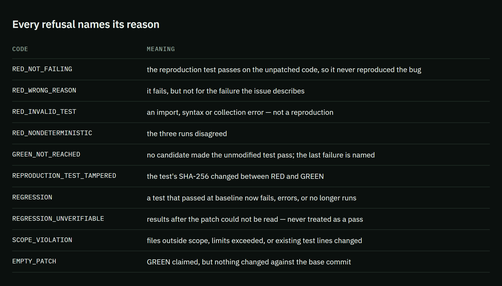
</p>

Each refusal carries a code that names the gate and the reason, so the patch author knows exactly what to fix.

### How well the gates work: benchmark

<p align="center">
  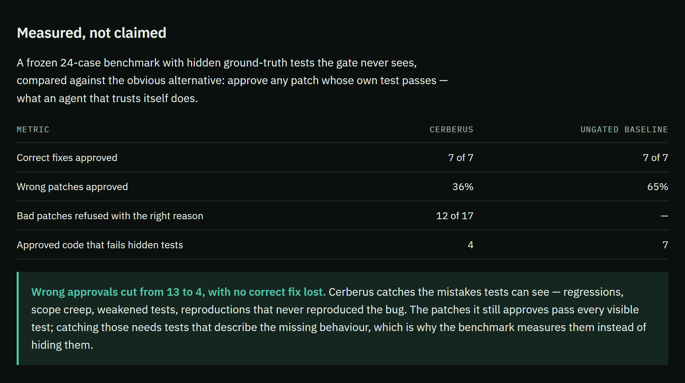
</p>

The benchmark measures one question: *does the gate refuse patches that should not become pull requests, compared with
approving any patch whose own test passes?* It uses 24 seeded cases — correct fixes, plausible-but-wrong fixes,
regressions, scope leaks, test weakening, non-reproducible issues and invalid reproduction tests — frozen by a SHA-256
manifest and scored by hidden tests that neither side sees. Cerberus approved all 7 correct fixes and cut wrong
approvals from 13 to 4; every wrong patch that the visible tests could expose was refused. Full report:
[`benchmark/reports/v1-docker.md`](autonomous-pr-fixer/benchmark/reports/v1-docker.md).

### Validation on real open-source repositories

<p align="center">
  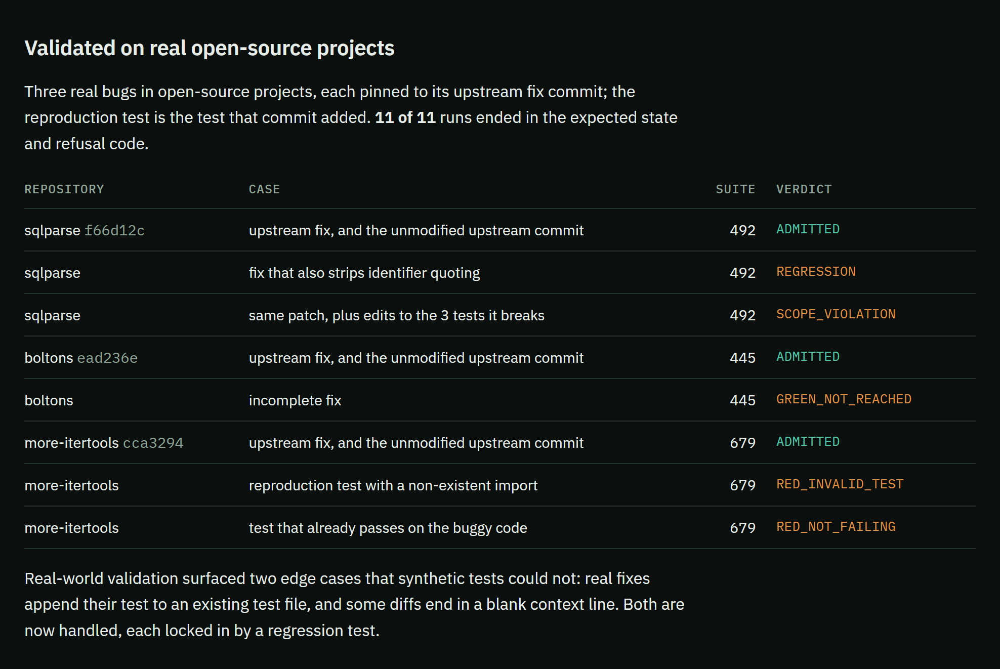
</p>

Three real bugs in projects Cerberus was not written against, each pinned to its upstream fix commit and judged by the
project's own test suite (492, 445 and 679 tests). All 11 runs — maintainer fixes, unmodified upstream commits and
deliberately wrong variants — ended in the expected verdict. Full report:
[`evaluation/external/report.md`](autonomous-pr-fixer/evaluation/external/report.md).

## Real-World Example

**sqlparse, upstream fix [`f66d12c`](https://github.com/andialbrecht/sqlparse/commit/f66d12c245412f28c58f045b646eb53c0e691b8b).**
For the SQL name `db.schema.tbl.col`, `Identifier.get_real_name()` returned `schema` instead of `col`.

1. **RED** — the reproduction test fails on the original code in 3 of 3 runs with an `AssertionError`.
2. **BASELINE** — all 492 sqlparse tests are run and recorded.
3. **GREEN** — with the maintainers' fix, the unchanged test passes in 3 of 3 runs.
4. **REGRESSION** — the 492 tests again: none newly failing.
5. **SCOPE** — one file changed, one function: `NameAliasMixin.get_real_name`.
6. **ADMITTED**, with the evidence recorded in `run.json`.

A second patch for the same bug also returned `col` — it passed RED and GREEN, so a check of its own test alone would
have approved it. It also changed how bracketed names such as `[foo bar]` are reported. The regression gate refused it,
naming the three existing sqlparse tests it broke. That is the failure mode Cerberus exists to catch.

## Security Model

Cerberus runs code from the repository under test, so the sandbox matters as much as the gates.

<p align="center">
  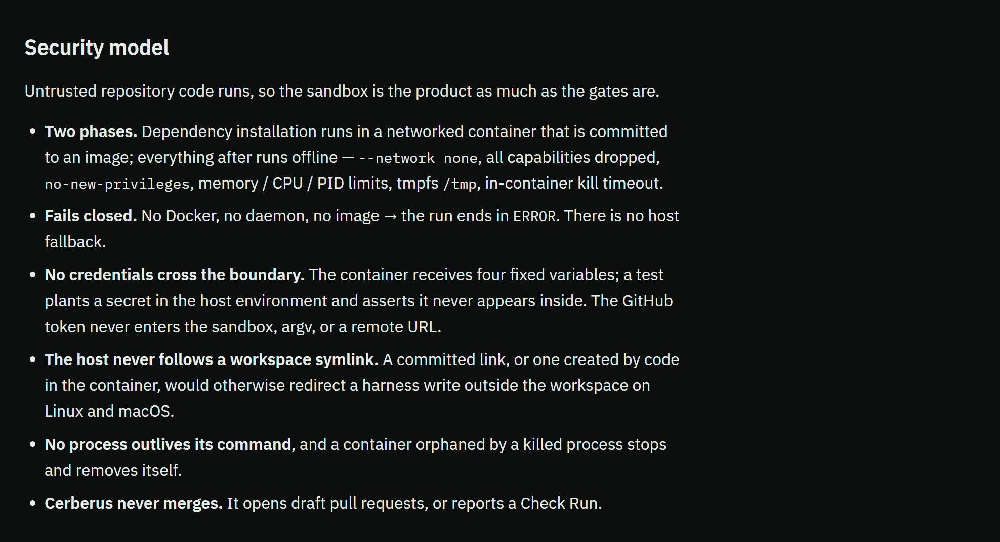
</p>

- **Docker isolation.** Verification runs in a container, never on the host, unless a developer explicitly opts in
  with `--unsafe-local-sandbox` for trusted local fixtures (which can never publish).
- **Network disabled during verification.** Dependencies install in a separate setup container that is committed to an
  image; every later step runs with `--network none`.
- **Least privilege.** All Linux capabilities dropped, `no-new-privileges`, and memory, CPU and process-count limits.
- **Bounded execution.** Each command runs under a kill timeout inside the container; processes left behind are killed
  after every command; a container orphaned by a killed host process stops and removes itself.
- **Fails closed.** If Docker, the daemon or the sandbox image is unavailable, the run ends in `ERROR` — there is no
  silent fallback to the host.
- **Credential isolation.** Containers receive a fixed four-variable environment; the GitHub token never enters the
  sandbox, the command line or a remote URL.
- **Symlink-safe host access.** The host never follows a symlink inside the workspace, so a link planted by repository
  content cannot redirect a harness read or write elsewhere.
- **No merging.** Cerberus reports a Check Run or opens a draft pull request; merging stays with a person.

These properties are asserted from inside real containers by
[`tests/test_docker_integration.py`](autonomous-pr-fixer/tests/test_docker_integration.py).

## Live GitHub Integration

Cerberus runs as a GitHub App. A reviewer asks for a check on a pull request and receives the verdict as a GitHub Check
Run, with the full evidence attached:

```text
pull request ─► comment "/cerberus verify" ─► GitHub webhook ─► Cerberus (signature verified)
            ─► verification in Docker ─► Check Run on the pull request: ADMITTED ✅ / REFUSED ❌
```

Only users with write access can trigger a check, bot events are ignored, and every delivery is signature-checked.

**1 — Triggering a check.** The reviewer comments `/cerberus verify`; about a minute later the commit carries the
verdict.

<p align="center">
  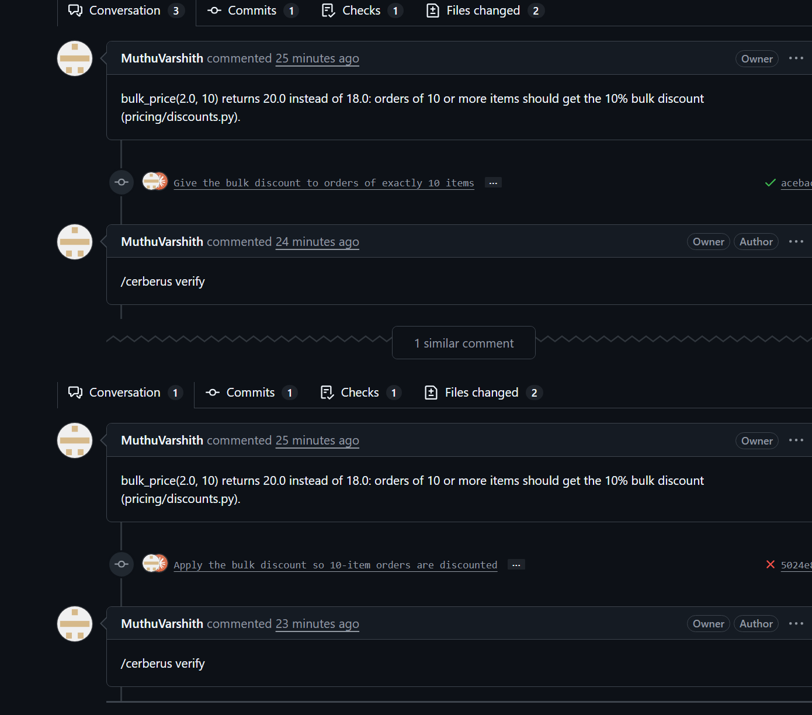
</p>

**2 — An admitted patch.** The Check Run is the evidence report: gate results, the reproduction test and the exact diff
that was verified.

<p align="center">
  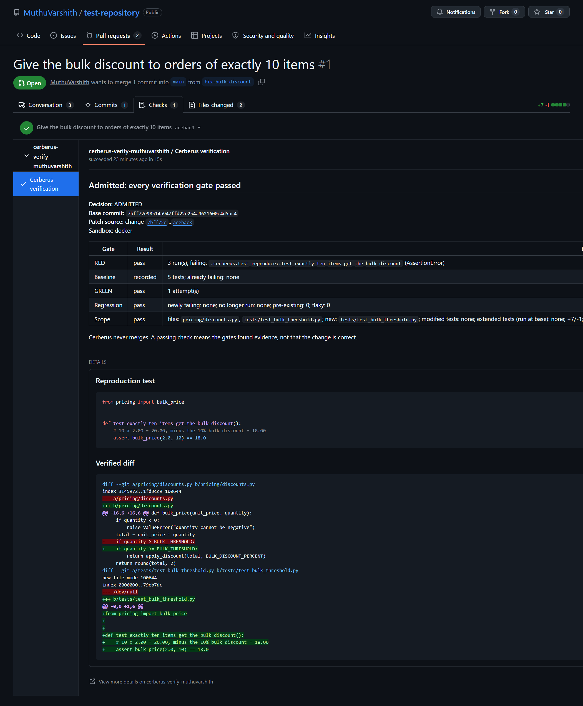
</p>

**3 — A refused patch.** A careless fix passes RED and GREEN but breaks an existing test; the refusal names it.

<p align="center">
  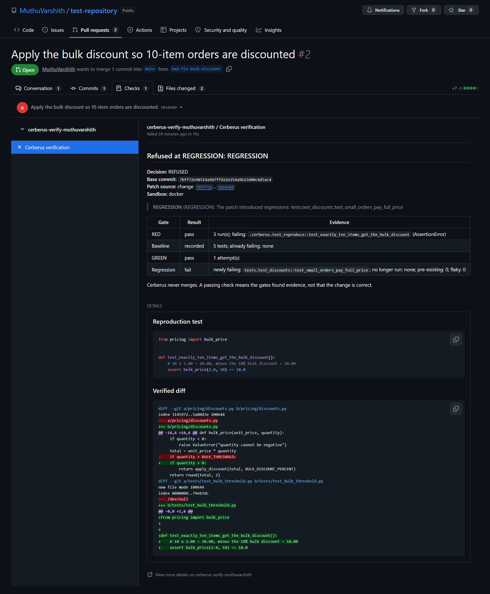
</p>

**4 — Why it failed, as it happens.** On [VoteVault](https://github.com/MuthuVarshith/VoteVault-), a Flask voting
app, a pull request fixed a crashing CSV export and also deleted the admin check in front of it. The terminal shows the
regression gate catching the security hole live.

<p align="center">
  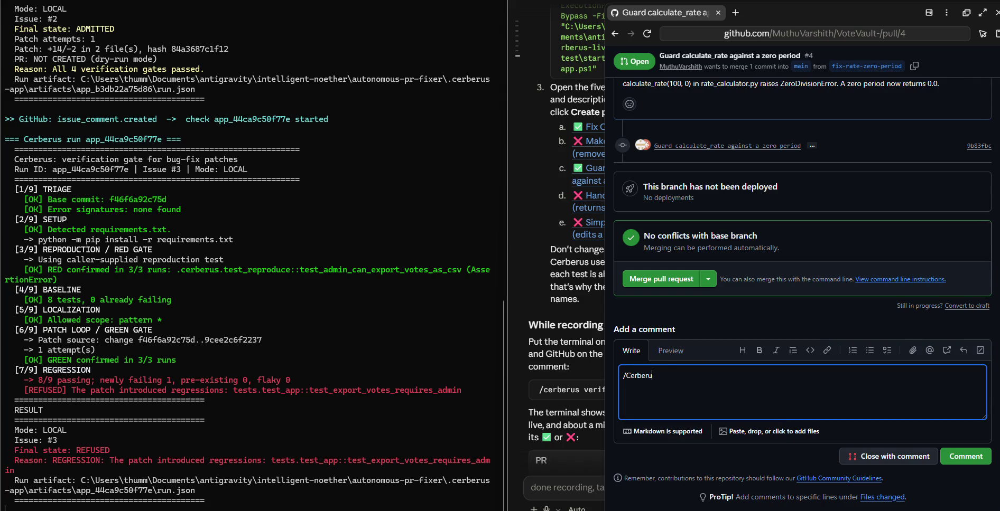
</p>

**5 — The reviewer's evidence.** The same refusal on GitHub: `test_export_votes_requires_admin` now fails, and the
verified diff shows the deleted lines.

<p align="center">
  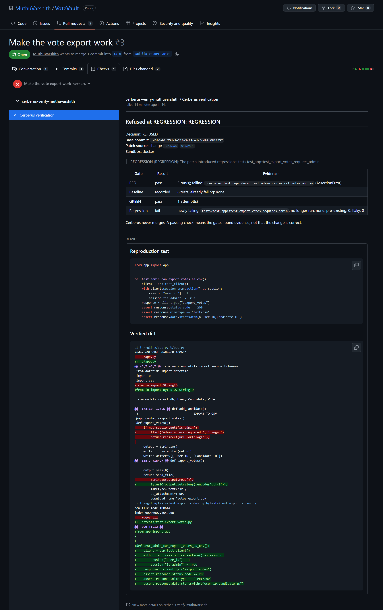
</p>

**6 — A second integrity case.** A pull request that changed a calculation and then edited an existing test to match is
refused with `SCOPE_VIOLATION`.

<p align="center">
  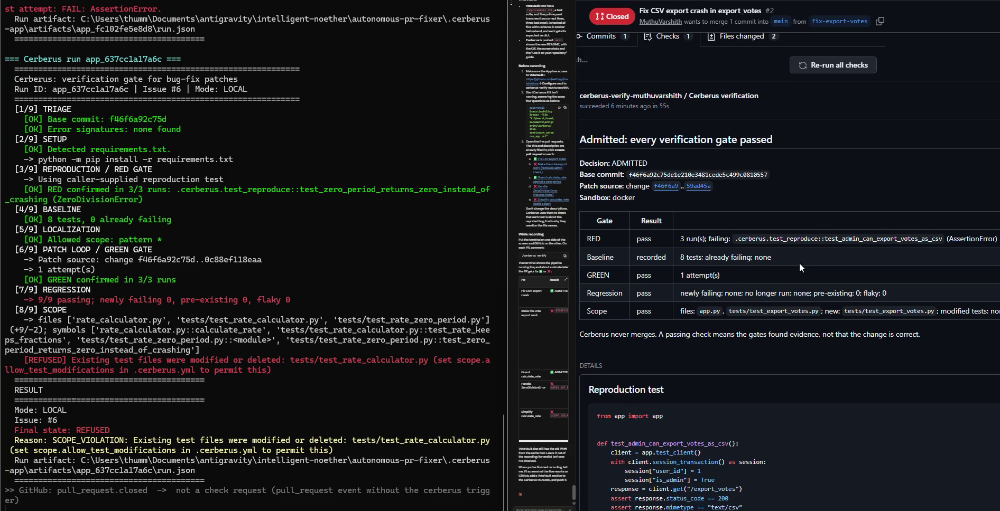
</p>

| Repository | Pull request | Verdict |
| --- | --- | --- |
| test-repository | [#1](https://github.com/MuthuVarshith/test-repository/pull/1) correct off-by-one fix | ✅ Admitted |
| test-repository | [#2](https://github.com/MuthuVarshith/test-repository/pull/2) discounts every order | ❌ `REGRESSION` |
| VoteVault | [#2](https://github.com/MuthuVarshith/VoteVault-/pull/2) fix the CSV export crash | ✅ Admitted |
| VoteVault | [#3](https://github.com/MuthuVarshith/VoteVault-/pull/3) fix the crash, delete the admin check | ❌ `REGRESSION` |
| VoteVault | [#4](https://github.com/MuthuVarshith/VoteVault-/pull/4) guard `calculate_rate` against zero | ✅ Admitted |
| VoteVault | [#5](https://github.com/MuthuVarshith/VoteVault-/pull/5) swallow the error, return `None` | ❌ `GREEN_NOT_REACHED` |
| VoteVault | [#6](https://github.com/MuthuVarshith/VoteVault-/pull/6) change the maths, edit an existing test | ❌ `SCOPE_VIOLATION` |

<p align="center">
  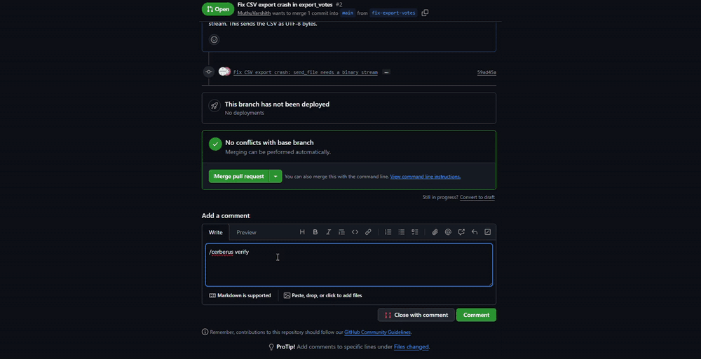
</p>

The VoteVault session in 30 seconds. Full recording:
[`docs/video/cerberus-github-app-full-demo.mp4`](docs/video/cerberus-github-app-full-demo.mp4).

## Quick Start

Requirements: Python 3.11+, Git and Docker.

```bash
cd autonomous-pr-fixer
python -m pip install -r requirements.txt
docker build -t cerberus-sandbox:py3.11 sandbox/
python main.py --demo
```

Run the test suite, and the real-repository check from the demo:

```bash
python -m pytest -q
python evaluation/external_repos.py --only sqlparse-332
```

## Verify a Patch

All commands run from `autonomous-pr-fixer/`. Each run uses exactly one patch source; the gates treat them all the same.

**A — A diff file**

```bash
python main.py --repo /path/to/repo \
  --issue 42 --title "parse_date fails on leap years" \
  --body "parse_date('2024-02-29') raises ValueError at dates/parse.py:18" \
  --repro-test path/to/test_reproduce.py \
  --patch path/to/fix.diff
```

**B — An existing branch or pull request**

```bash
python main.py --repo /path/to/repo \
  --title "parse_date fails on leap years" --body "..." \
  --repro-test path/to/test_reproduce.py \
  --base main --head fix-branch
```

The workspace is the `--base` commit and the candidate is `git diff base head`. New tests — including tests appended to
an existing test file — are allowed; changing or deleting existing test lines is refused.

**C — An external coding agent**

```bash
python main.py --repo /path/to/repo --title "..." --body "..." \
  --repro-test path/to/test_reproduce.py --agent-command "your-agent --flags"
```

The agent runs in a throwaway copy of the base commit; the prompt is sent on stdin, and `{prompt_file}` and `{workdir}`
are substituted in the command. Cerberus captures the edits the agent leaves behind as a diff and judges it like any
other patch. A preset for Claude Code is available as `--agent claude-code`; it allows file tools only, with no shell,
so the agent cannot run the tests that judge it.

**D — A model-generated patch (optional)**

```bash
python main.py --repo /path/to/repo --title "..." --body "..." \
  --repro-test path/to/test_reproduce.py --use-llm
```

Requires a provider API key (see [Configuration](#configuration)); `--use-llm-repro` also generates the reproduction
test. Model output is held to the same gates. Without a key, the run is refused rather than silently skipped.

## Configuration

<details>
<summary><b>Per-repository policy: <code>.cerberus.yml</code></b></summary>

Optional, at the repository root, and read from the **base** commit before any repository code runs. A patch that edits
it is refused; unknown keys or invalid values end the run in `ERROR`.

```yaml
version: 1
setup:                                  # replaces the detected install commands (networked setup phase)
  - python -m pip install -e ".[test]"
test:
  command: python -m pytest -q          # pytest commands get --junitxml appended
  # command: tox -e py311 -- --junitxml={junit_xml}   # or use the placeholder
  # report: build/junit.xml                            # or read a report the command writes itself
  exclude:                              # JUnit test IDs (fnmatch) ignored by baseline and regression
    - "tests.test_network::*"
scope:
  allowed_paths: ["src/*"]              # fnmatch globs; default is the localized file
  max_files: 3
  max_lines: 200
  allow_test_modifications: false
budgets:
  patch_attempts: 5                     # 1–20
  red_runs: 3                           # 1–10
  green_runs: 3                         # 1–10
  command_timeout_seconds: 600          # 10–7200
```

The regression gate accepts any test runner that writes JUnit XML; RED and GREEN require pytest.

</details>

<details>
<summary><b>Environment variables</b></summary>

Read directly from the process environment; `.env` files are not loaded. See
[`.env.example`](autonomous-pr-fixer/.env.example).

| Variable | Purpose |
| --- | --- |
| `CERBERUS_SANDBOX`, `CERBERUS_SANDBOX_IMAGE` | `docker` (default) or `host-unsafe`; sandbox image name |
| `CERBERUS_SANDBOX_MAX_LIFETIME_SECONDS` | Container self-removal deadline (default 14400) |
| `SANDBOX_TIMEOUT_SECONDS` | Default per-command timeout (default 60) |
| `PATCH_MAX_ATTEMPTS`, `PATCH_MAX_LINES_CHANGED` | Patch-loop budget (defaults 5 and 200) |
| `RUN_ARTIFACTS_DIR` | Where `run.json` files are written (default `artifacts`) |
| `ANTHROPIC_API_KEY`, `OPENAI_API_KEY`, `GEMINI_API_KEY`, `CERBERUS_MODEL` | Optional model access |
| `CERBERUS_USE_LLM`, `CERBERUS_USE_LLM_REPRO` | Enable model patch / reproduction generation |
| `GITHUB_WEBHOOK_SECRET`, `GITHUB_APP_ID`, `GITHUB_APP_PRIVATE_KEY` / `GITHUB_APP_PRIVATE_KEY_PATH` | GitHub App identity |
| `CERBERUS_DATA_DIR`, `CERBERUS_MAX_RUNS_PER_HOUR`, `CERBERUS_RUN_TIMEOUT_SECONDS` | GitHub App state and limits |
| `CERBERUS_REPAIR_PATCH_SOURCE`, `CERBERUS_PUBLISH_REPAIRS` | `/cerberus repair` patch source; whether to open draft PRs |
| `GITHUB_TOKEN`, `GITHUB_REPO_SLUG`, `GITHUB_BASE_BRANCH` | Publishing from the CLI without the App |
| `LOG_LEVEL` | Log verbosity |

</details>

## GitHub App Setup

Cerberus runs as a GitHub App that you register under your own account and run on your own machine or server.

**Repository requirements.** Python code with a pytest suite that passes on the base branch and runs offline (no
database, network or API keys during tests); dependencies installable with pip (`requirements.txt`, `pyproject.toml`
or `setup.py`, or a `.cerberus.yml` `setup:` list); and a pull request that adds **exactly one new test file** that fails
before the fix and passes after it. The pull request description (or a linked `Fixes #N` issue) should name the
function involved — the RED gate checks that the test exercises what the report describes. A pull request that only
appends its test to an existing test file is refused by the App with guidance; the CLI can verify it with
`--base/--head --repro-test`.

1. **Create the App** — GitHub → Settings → Developer settings → GitHub Apps → **New GitHub App**.
2. **Webhook URL** — your server's `https://…/webhook`, or a [smee.io](https://smee.io/new) channel when running on a
   laptop.
3. **Webhook secret** — a long random string. Cerberus rejects every delivery whose signature does not match it.
4. **Repository permissions** — **Checks:** Read & write · **Issues:** Read & write · **Contents:** Read-only ·
   **Pull requests:** Read-only · **Metadata:** Read-only (automatic). Everything else: *No access*. (`/cerberus repair`
   with draft-PR publishing additionally needs Contents and Pull requests set to Read & write.)
5. **Subscribe to events** — **Issue comment** and **Pull request**.
6. **Install the App** — generate a private key (keep the `.pem` private), then **Install App** → **Only select
   repositories**.

   <p align="center">
     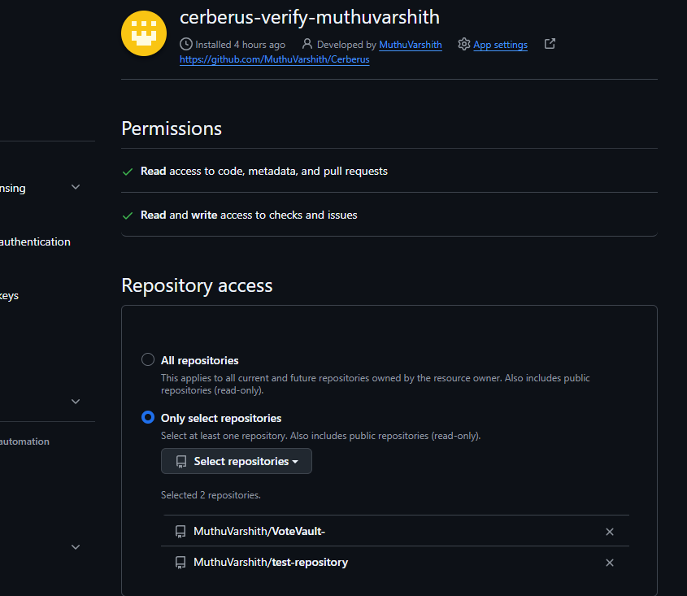
   </p>

7. **Start Cerberus** — with Docker running and the sandbox image built:

   ```bash
   export GITHUB_APP_ID=123456
   export GITHUB_APP_PRIVATE_KEY_PATH=/path/to/your-app.private-key.pem
   read -rs GITHUB_WEBHOOK_SECRET && export GITHUB_WEBHOOK_SECRET
   python tools/github-app/smee_forward.py https://smee.io/YOUR-CHANNEL http://127.0.0.1:8000/webhook &
   cd autonomous-pr-fixer && python -m uvicorn github.webhook_handler:app --host 127.0.0.1 --port 8000
   ```

   [`smee_forward.py`](tools/github-app/smee_forward.py) relays deliveries from smee.io without altering the signed body
   (on a server with a public HTTPS address, skip it). On Windows,
   [`start_cerberus_app.ps1`](tools/github-app/start_cerberus_app.ps1) does all of this in one command, prompts for the
   secret as hidden input, and streams each check's pipeline in the terminal.
8. **Trigger a check** — comment `/cerberus verify` on a pull request, or add a `cerberus` label (new commits on a
   labelled pull request are re-checked automatically).
9. **Read the Check Run** — the commit shows ✅ or ❌; **Details** opens the evidence. Each run's full output is also
   written to `autonomous-pr-fixer/.cerberus-app/work/<run_id>/cli.log`.

The service exposes only `GET /health` and `POST /webhook`, processes one run per repository at a time, caps runs per
hour, and applies a wall-clock timeout to every run.

## Project Structure

```text
autonomous-pr-fixer/
├── main.py         CLI and pipeline orchestration
├── agents/         reproduction (RED/GREEN), regression, patch loop, patch sources, repository setup
├── harness/        Docker sandbox, JUnit parsing, scope gate, admission controller, state machine
├── github/         GitHub App: authentication, webhook, run store, Check Runs, PR publishing
├── retrieval/      Python AST index and lexical search
├── sandbox/        Dockerfile for the verification image
├── benchmark/      frozen instances, hidden tests, manifest, reports
├── evaluation/     benchmark runner and real-repository runner
├── examples/       demo project
└── tests/          231 tests, including real-Docker integration tests
docs/assets/        screenshots and recordings used in this README
tools/github-app/   smee.io relay and Windows launcher for running the App locally
site/               one-page visual summary
```

Built with Python, pytest, JUnit XML, Docker, Git, FastAPI, SQLite and the GitHub REST API.

## Documentation

| Document | Purpose |
| --- | --- |
| [`DEMO.md`](DEMO.md) | Demonstration and recording guide |
| [`INTERVIEW.md`](INTERVIEW.md) | Design decisions, explained question by question |
| [`PORTFOLIO.md`](PORTFOLIO.md) | Concise project summary |
| [`site/index.html`](site/index.html) | Visual one-page summary |
| [Benchmark report](autonomous-pr-fixer/benchmark/reports/v1-docker.md) | Detailed benchmark evidence |
| [External evaluation report](autonomous-pr-fixer/evaluation/external/report.md) | Real-repository validation |
| [`docs/video/`](docs/video/cerberus-github-app-full-demo.mp4) | Full recording of the live GitHub App session |
| [`CERBERUS_PROGRESS.md`](CERBERUS_PROGRESS.md) | Engineering history and test log |

## Limitations

- Cerberus is research and engineering software for Python projects tested with pytest.
- Passing visible tests does not prove semantic correctness. The frozen benchmark still contains four false admissions:
  plausible-but-wrong patches that pass every visible test.
- Benchmark and evaluation results are specific to the tested cases — 24 seeded instances and three external bugs chosen
  for fast test suites — and are not a statistical estimate for arbitrary projects.
- Docker validation was performed with Docker Desktop on Windows; the symlink defences are unit-tested on Linux, but a
  Linux or macOS host running the full sandbox has not been validated.
- GitHub App validation covers the documented live setup: a locally running service behind a smee.io relay, on two
  repositories. The App requires a pull request to add exactly one new test file.
- An external coding-agent integration is implemented; end-to-end validation with a live agent remains an explicit
  limitation.
- A deliberately malicious repository could forge its own test results, because repository code runs in the same process
  as its test runner. Cerberus verifies patches to trusted-but-buggy repositories.

## Author

**Muthu Varshith**

GitHub: [github.com/MuthuVarshith](https://github.com/MuthuVarshith)<br>
Email: [muthuvarshith290@gmail.com](mailto:muthuvarshith290@gmail.com)

## License

Released under the [MIT License](LICENSE).
